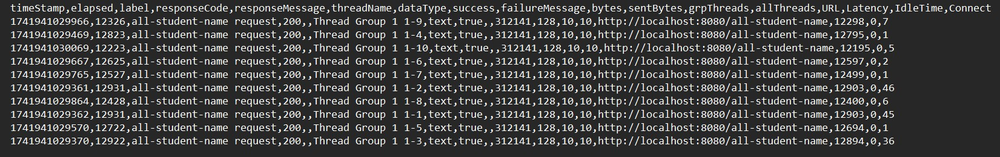
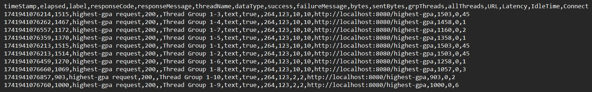

## Images

Hasil JMeter GUI (Before optimization):

Hasil JMeter CMD (Before optimization):

Hasil JMeter GUI (After optimization):

Hasil JMeter CMD (After optimization):

Setelah melakukan optimisasi, dapat kita lihat bahwa ada peningkatan dalam hasil pengukuran JMeter. Bila kita lihat, 
ada peningkatan sekitar 20% pada setiap thread pada Thread Group untuk test all-student-name request. Ini diperlihatkan 
dengan pengurangan waktu yang setara dengan nilai awal elapsed time. Selain itu, pada test untuk highest-gpa request,
pengurangan waktunya jauh lebih terlihat, dengan pengurangan waktu sekitar 70%-75% yang membuktikan bahwa optimisasinya 
sudah berjalan dengan baik.

## Reflection
1. What is the difference between the approach of performance testing with JMeter and profiling with IntelliJ Profiler 
in the context of optimizing application performance?
   - Performance testing dengan JMeter biasanya digunakan untuk melakukan pengujian pada suatu endpoint, sementara 
   performance testing menggunakan IntelliJ Profiler digunakan untuk menguji tingkat kode pada bagian area tertentu.

2. How does the profiling process help you in identifying and understanding the weak points in your application?
   - Dengan menggunakan profiling kita dpaat mengecek titik lemah dari aplikasi yang kita kembangkan. Lebih tepatnya,
   kita dapat mengetahui apa yang membuat aplikasi menjadi lebih lambat dari sisi pemrograman sehingga kinerja aplikasi
   kita tidak berjalan dengan semaksimal mungkin.

3. Do you think IntelliJ Profiler is effective in assisting you to analyze and identify bottlenecks in your application code?
   - Menurut saya IntelliJ Profiler berguna dalam membantu saya mengidentifikasi bagian kode palikasi yang memakan 
   banyak performa aplikasi sehingga kita dapat dengan lebih mudah memperbaikinya. Selain itu, kita juga melihat hasil
   analisis dari beragam bagian aspek dari pengunaan CPU, memori, dan total waktu yang diperlukan untuk menyelesaikan
   task yang ingin dijalankan dengan lebih optimized. 
   
4. What are the main challenges you face when conducting performance testing and profiling, and how do you overcome 
these challenges?
   - Menurut saya yang menjadi hal yang paling menantang saat melakukan performance testing adalah saat saya melakukan
   analisis terhadap hasil yang diberikan oleh Profiling.

5. What are the main benefits you gain from using IntelliJ Profiler for profiling your application code?
   - IntelliJ Profiler membantu saya dalam mengecek hal-hal yang saya lewati, terutama dalam hal performa, apalagi bila
   proyek yang sedang saya kerjakan sudah sangat besar.

6. How do you handle situations where the results from profiling with IntelliJ Profiler are not entirely consistent with 
findings from performance testing using JMeter?
   - Secara tren, keduanya memberikan hasil yang sama, dengan maksud keduanya menghasilkan hasil analisa performa yang
   menandakan kode sudah berhasil dioptimisasi dengan baik. Namun, nilai-nilai yang dihasilkan sedikit berbeda, yang
   kemungkinan besar disebabkan oleh run yang berbeda.

7. What strategies do you implement in optimizing application code after analyzing results from performance testing and 
profiling? How do you ensure the changes you make do not affect the application's functionality?
   - Pertama saya menggunakan IntelliJ Profiler dan JMeter untuk mengidentifikasi bagian-bagian yang membuat kinerja
   aplikasi saya menjadi lebih lambat. Setelah masalah teridentifikasi, saya dapat dengan lebih mudah mencari sebuah 
   alternatif untuk mempercepat atau mengoptimisasi implementasi kode yang digunakan dalam pengembangan aplikasi. Dengan
   demikian, saya dapat dengan lebih baik mengatasi bagian-bagian yang terlewati oleh saya.